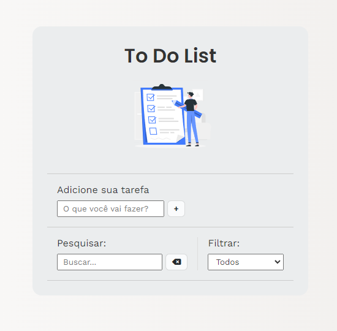
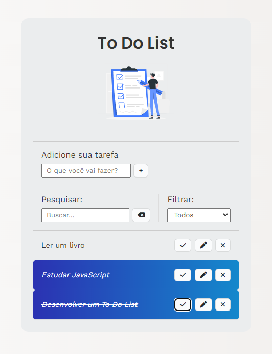

# 📋 Indíce

- [Bem-vindo](#id01)
- [Proposta](#id02)
- [O desafio e objetivo](#id02.1)
- [Screenshots](#id04)
- [Links](#id05)
- [Pré-requisitos](#id07)
- [Procedimentos de instalação](#id08)
- [Agradecimentos](#id09)

# Bem-vindo! 👋 <a name="id01"></a>

**To Do List.**

Criação de um To Do List utilizando HTML, CSS & JavaScript.

# 🚀 Proposta <a name="id02"></a>

Esse projeto foi desenvolvido com o objetivo de melhorar a produtividade e organização diaria.

Proposto pelo [Matheus Battisti - Hora de Codar](https://www.youtube.com/watch?v=HSssE1PRQcA&ab_channel=MatheusBattisti-HoradeCodar) no YouTube e recriado com meus conhecimentos em UI Design.

<br />

## :trophy: O desafio <a name="id02.1"></a>

<br />

Os principais pontos da aplicação são:

- Adicionar novas tasks e remover as que já estão incluídas;

- Editar nome da tarefa;

Assuntos estudados neste projeto:

- LocalStorage para guardar as tarefas;

- Selecionar elemento no JS;

- Manipulação do DOM;

- Adicionar elemento HTML pelo JavaScript;

- Receber e tratar inputs no JS;

- Eventos JS;

- Métodos JS;

<br />

# :camera_flash: Screenshots <a name="id04"></a>

<br />

## :desktop_computer: Desktop design



## :iphone: Mobile design



<br />

# :heavy_check_mark: Links <a name="id05"></a>

<br />

- Clique no link para acessar a página: https://lively-kangaroo-a1eaa7.netlify.app/

<br />

# ☑️ Pré-requisitos <a name="id07"></a>

<br />

- [x] Editor de código de sua preferência (recomendado VS code)
- [x] Git

<br />

# 📝 Procedimentos de instalação <a name="id08"></a>

<br />

Clone este repositório usando o comando:

```bash
git clone https://github.com/luanacaldas/To-do-list.git
```

Baixar arquivo zip

Extrir arquivos

Abrir pasta no editor de código.

<br />

# :sunglasses: Agradecimentos <a name="id09"></a>

<br />

Agradeço por chegar até aqui e espero que goste do projeto.

Conheça mais sobre mim no meu Linkedin: https://www.linkedin.com/in/luanavalimm/

<br />
